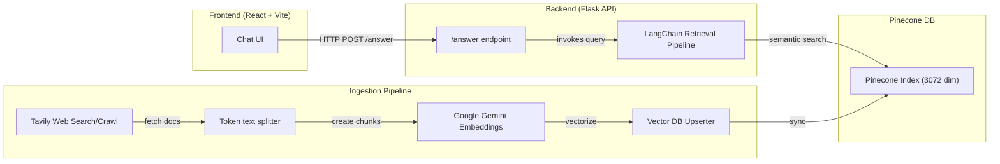

# LangChain Chat with Gemini 2.0

A documentation-grounded chatbot built for the LangChain ecosystem. It intelligently retrieves answers from official documentation using Tavily & Pinecone, seamlessly citing inline source URLs while preserving conversation context. This project leverages the modern Gemini 2.5 Flash architecture.

## Why this project?

The chatbot prevents over-reliance on RAG vector bases by using a scoring threshold:
1. **General question:** RAG is intelligently skipped. The query is passed to the Gemini LLM and sourced as `model_only`!
2. **Documentation question:** Vector matches correctly pass threshold. Pinecone returns accurate data and explicitly attributes matching documentation websites.
3. **Follow-ups:** Standard LLM behavior with preserved system chat history smoothly handles context requests! It remembers what was previously asked without unnecessary RAG database pollution.

## Tech Stack
- **Backend**: Python 3.11+, Flask API, LangChain
- **LLM + Embeddings**: Google Generative AI (`gemini-2.5-flash`, `gemini-embedding-2`)
- **Vector Store**: Pinecone (3072 dimension `cosine` index)
- **Crawler**: Tavily Web Crawler
- **Frontend**: React 19, Vite, Tailwind/shadcn ui

## System Architecture Blueprint



## Quick Start & Setup

**Prerequisites:** 
- Python 3.11+, Node JS v20+
- Accounts for [Google AI Studio](https://aistudio.google.com/), [Pinecone](https://pinecone.io/), and [Tavily](https://tavily.com/).

### 1. Configure the `.env` Blueprint
Create a `.env` in the root and add your API keys:
```properties
PINECONE_API_KEY=YOUR_PINECONE_API_KEY
INDEX_NAME=langchain-doc-index
GOOGLE_API_KEY=YOUR_GEMINI_API_KEY
TAVILY_API_KEY=YOUR_TAVILY_API_KEY
FLASK_SECRET_KEY=yoursecret  # optional
```

### 2. Configure Pinecone Settings
Ensure your pinecone database configuration strictly adheres to:
- **Index Name:** `langchain-doc-index` (MUST MATCH `.env`)
- **Dimensions:** `3072` (Required for `gemini-embedding-2`)
- **Metric:** `cosine`

### 3. Server Deployment
Open two terminals.

**Terminal 1 — Backend & Ingestion:**
Configure your virtual environment and install dependencies.
```bash
python -m venv .venv
# Activate: .\venv\Scripts\activate OR source .venv/bin/activate
pip install -r requirements.txt
```

Start the ingestion process (Crawls URLs and creates embeddings). Only run once or upon doc updates.
```bash
python ingestion.py
```

Finally, launch the Flask API.
```bash
python main.py
```

**Terminal 2 — Frontend Portal:**
Run the React interface.
```bash
cd frontend
npm install
npm run dev
```
Navigate to `http://localhost:5173`. 🚀
